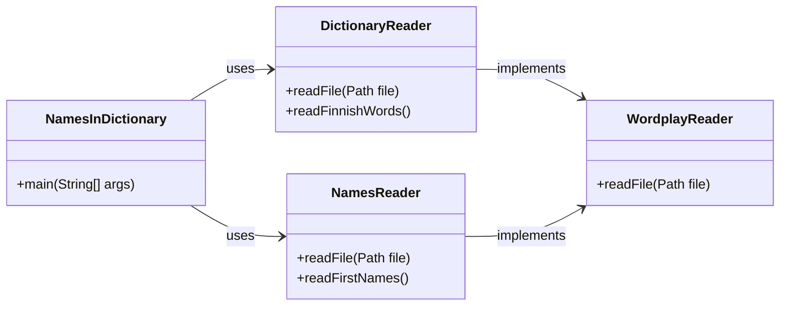

# Wordplay lesson exercise

The purpose of this exercise is to familiarize yourself with various data structures and algorithms, particularly from the perspective of their performance. We will also touch on program performance testing and the concept of ["asymptotic computational complexity"](https://en.wikipedia.org/wiki/Asymptotic_computational_complexity).

In the first part of the exercise, we will explore the performance of Java lists. In the latter part, the application to be developed will utilize open name and dictionary data and search for Finnish first names that also have another meaning in the dictionary. Examples of such names are *Tuuli* (wind) and *Onni* (happiness).

💡 *This exercise is not to be submitted or graded separately, so there is no GitHub classroom link for it. You can create your own copy of the task using either the "use this template" or "fork" functions.*

## Data used in the exercise

The Java programs in this exercise utilize several files that are in slightly different formats: the dictionary content is in plain text, while the name data is in CSV format.

The file [`kaikkisanat.txt`](./data/kaikkisanat.txt)  in the exercise package contains Finnish words in plain text in alphabetical order. The files [`etunimitilasto-naiset-ensimmainen.csv`](./data/etunimitilasto-naiset-ensimmainen.csv) and [`etunimitilasto-miehet-ensimmainen.csv`](./data/etunimitilasto-miehet-ensimmainen.csv) contain first names and their counts in [CSV format](https://en.wikipedia.org/wiki/Comma-separated_values).

Information about file copyrights and terms of use can be found further down this page under "Copyrights".

💡 *All files for this exercise are saved with [`UTF-8` character encoding](https://en.wikipedia.org/wiki/UTF-8). `UTF-8` is [the most common character encoding](https://en.wikipedia.org/wiki/Popularity_of_text_encodings), but especially in a Windows environment, your system might use a different encoding. You can find more information about character encodings in [this article](https://www.baeldung.com/java-char-encoding).*

## Part 1: performance testing of `ArrayList` and `LinkedList`

In the package [`wordplay.benchmark`](./src/main/java/wordplay/benchmark/) of this repository, you can find the classes [`ArrayListBenchmark`](./src/main/java/wordplay/benchmark/ArrayListBenchmark.java) and [`LinkedListBenchmark`](./src/main/java/wordplay/benchmark/LinkedListBenchmark.java), which contain performance tests. The performance tests illustrate significant differences between `ArrayList` and `LinkedList` in terms of data retrieval, traversal, and insertion.

The performance tests are implemented using the [Java Microbenchmark Harness (JMH)](https://github.com/openjdk/jmh) tool:

> *"JMH is a Java harness for building, running, and analysing nano/micro/milli/macro benchmarks written in Java and other languages targeting the JVM."*
>
> https://github.com/openjdk/jmh

Run the performance tests by executing the [`BenchmarkRunner`](./src/main/java/wordplay/benchmark/BenchmarkRunner.java) class either with your code editor or using Gradle:

```sh
./gradlew run      # unix
.\gradlew.bat run  # windows
```

💡 *If special characters in the output, such as &thickapprox; and <sup>-4</sup>, do not display correctly on Windows, you can try [changing the terminal's encoding](https://www.google.com/search?q=chcp+65001) to UTF-8 with the command `chcp 65001`.*

`BenchmarkRunner` executes a series of performance tests and prints information about the progress of the tests. The performance tests consist of both a warm-up phase and repeated calls to the methods being tested. The warm-up phase is important to ensure that all necessary components are loaded and the required resources are allocated from the hardware before the actual measurement. The results of the tests, i.e., the average execution time of the different methods, can be found at the end of the report once it is completed:

```
Benchmark                                              Mode  Cnt   Score    Error  Units
ArrayListBenchmark.accessArrayListWithIndex            avgt    5  ≈ 10⁻⁴            s/op
LinkedListBenchmark.accessLinkedListWithIndex          avgt    5   2.792 ±  0.118   s/op

ArrayListBenchmark.accessArrayListWithIterator         avgt    5  ≈ 10⁻⁴            s/op
LinkedListBenchmark.accessLinkedListWithIterator       avgt    5  ≈ 10⁻⁴            s/op

ArrayListBenchmark.addStringsToBeginningOfArrayList    avgt    5   0.426 ±  0.052   s/op
LinkedListBenchmark.addStringsToBeginningOfLinkedList  avgt    5   0.001 ±  0.001   s/op
```

Above, *"avgt"* means *"average time"*. *"Cnt"* refers to the number of executions, and *"score"* indicates the average duration of a single execution of the tested method. *"s/op"* is the unit, meaning seconds per method execution. A more detailed explanation of the executed methods can be found in the following paragraphs.

### Haku listalta indeksin avulla (*accessArrayListWithIndex* ja *accessLinkedListWithIndex*)

Luokissa [`ArrayListBenchmark`](./src/main/java/wordplay/benchmark/ArrayListBenchmark.java) ja [`LinkedListBenchmark`](./src/main/java/wordplay/benchmark/LinkedListBenchmark.java) testataan samoja operaatioita sekä `ArrayList`- että `LinkedList`-tyyppisen listan kanssa. Ensimmäisissä metodeissa suomenkielinen sanalista käydään läpi alusta loppuun ja jokaisen sanan kohdalla kutsutaan sen `length()`-metodia.

Suorituskykytestit on *annotoitu* `@Benchmark`-annotaatiolla, jonka avulla JMH-työkalu tietää niiden olevan suorituskykytestejä:

```java
ArrayList<String> arrayList = new ArrayList<>(finnishWords); // 93 086 sanaa

@Benchmark
public void accessArrayListWithIndex() {
    for (int i = 0; i < arrayList.size(); i++) {
        arrayList.get(i).length();
    }

    // metodin suoritusaika on keskimäärin 0,0001 sekuntia
}
```

Yllä oleva [`ArrayList`-tyyppistä listaa hyödyntävä koodi](./src/main/java/wordplay/benchmark/ArrayListBenchmark.java) on lähes identtinen [alla olevan `LinkedList`-version kanssa](./src/main/java/wordplay/benchmark/LinkedListBenchmark.java):

```java
LinkedList<String> linkedList = new LinkedList<>(finnishWords); // 93 086 sanaa

@Benchmark
public void accessLinkedListWithIndex() {
    for (int i = 0; i < linkedList.size(); i++) {
        linkedList.get(i).length();
    }

    // metodin suoritusaika on keskimäärin 2.792 sekuntia
}
```

Kuten testin tuloksista huomataan, koodi, jossa käydään [noin 93&nbsp;086 sanan pituinen aineisto](./data/kaikkisanat.txt) läpi yksi kerrallaan indeksien avulla vie `ArrayList`-listalta keskimäärin 10<sup>-4</sup> eli **0.0001 sekuntia**. `LinkedList`-tyyppiseltä listalta sama läpikäynti vie keskimäärin peräti **2.792 sekuntia**, eli **noin 30&nbsp;000 kertaa kauemmin**:

```
Benchmark                                           Mode  Cnt   Score    Error  Units
ArrayListBenchmark.accessArrayListWithIndex         avgt    5  ≈ 10⁻⁴            s/op
LinkedListBenchmark.accessLinkedListWithIndex       avgt    5   2.792 ±  0.118   s/op
```

`ArrayList`-tyyppisessä listassa tietyn arvon hakeminen indeksillä edellyttää vain yhden hakuoperaation, [koska se hyödyntää sisäisesti taulukkoa](https://github.com/openjdk/jdk/blob/6aa197667ad05bd93adf3afc7b06adbfb2b18a22/src/java.base/share/classes/java/util/ArrayList.java#L133-L139). Listan kaikkien arvojen läpikäynti edellyttää siis vain saman verran operaatioita, kuin listalla on pituutta:

```java
// toistetaan listan pituuden verran (n kpl):
for (int i = 0; i < arrayList.size(); i++) {

    // haku taulukosta vaatii vain 1 operaation
    arrayList.get(i);
}

// yhteensä siis tehdään n * 1 operaatiota: O(n)
```

`LinkedList`-tyyppisissä listoissa alkiot ovat "peräkkäin" ja yksittäisen arvon hakeminen keskeltä [edellyttää kaikkien sitä edeltävien arvojen läpikäyntiä joko alusta tai lopusta haluttuun indeksiin asti](https://github.com/openjdk/jdk/blob/6aa197667ad05bd93adf3afc7b06adbfb2b18a22/src/java.base/share/classes/java/util/LinkedList.java#L574-L591). Esimerkiksi indeksistä 10 hakeminen linkitetyltä listalta vaatii siis ensin "linkkien/solmujen" 0, 1, 2, ... 9 läpikäyntiä, olettaen, että lähdetään liikkeelle listan alusta.

Koska Javan linkitettyä listaa voidaan käydä läpi joko [alusta loppuun tai lopusta alkuun](https://docs.oracle.com/en/java/javase/21/docs/api/java.base/java/util/LinkedList.html), on jokaisen listalla olevan indeksin keskimääräinen etäisyys lähtöpisteestä 1/4 listan pituudesta. Hakuoperaatio noin 90&nbsp;000 sanan pituiselta listaltamme vaatii siis keskimäärin noin 22&nbsp;500 "linkin/solmun" läpikäyntiä.

```java
// listan pituuden (n) verran operaatioita:
for (int i = 0; i < linkedList.size(); i++) {

    // jokainen `get`-kutsu vaatii keskimäärin n/4 operaatiota:
    linkedList.get(i);
}

// yhteensä siis tehdään noin n * n/4 operaatiota: O(n²)
```

Suorituskykytesteissä ja tehokkuutta arvioitaessa mittaustarkkuus ei ole täydellinen, eikä siihen oikeastaan tarvitse edes pyrkiä. Oleellisempaa on ymmärtää, miten algoritmi suoriutuu suhteessa sen käsittelemän tietojoukon kokoon. Algoritmi, jonka suorittamien operaatioiden suhde tietojoukon kokoon on `n * n/4`, skaalautuu yhtä huonosti kuin algoritmi, jonka suhde on `n * n` eli <code>n<sup>2</sup></code>.

Operaatioiden kestot ja määrät eivät ole niin yksiselitteisiä kuin edellä on esitetty, mutta teorian ja suorituskykytestien perusteella vaikuttaa vahvasti siltä, että `LinkedList` suoriutui testistä tällä suomenkielisen sanalistan sisältävällä tietoaineistolla **kymmeniä tuhansia kertoja** hitaammin kuin `ArrayList`.

💡 *On myös tärkeää huomata, että aineiston määrän kasvaessa myös ero suorituskyvyssä kasvaa. Jos listassa olisi kymmenkertainen määrä alkioita, `ArrayList`:in läpikäynti veisi kymmenen kertaa enemmän aikaa. `LinkedList`:in läpikäynti puolestaan veisi arviolta sata kertaa enemmän aikaa, koska läpi käytäviä indeksejä olisi kymmenkertainen määrä. Lisäksi jokaista indeksiä kohden tehtävä `get(i)`-kutsu olisi myös keskimäärin kymmenen kertaa nykyistä hitaampi.*


### Listan iterointi (*accessArrayListWithIterator* ja *accessLinkedListWithIterator*)

Samoissa suorituskykytestiluokissa [`ArrayListBenchmark`](./src/main/java/wordplay/benchmark/ArrayListBenchmark.java) ja [`LinkedListBenchmark`](./src/main/java/wordplay/benchmark/LinkedListBenchmark.java) on myös toiset testimetodit, joissa sekä `ArrayList`- että `LinkedList`-tyyppisten listojen arvot käydään läpi yksi kerrallaan *iteroimalla*:

```java
ArrayList<String> arrayList = new ArrayList<>(finnishWords);

@Benchmark
public void accessArrayListWithIterator() {
    for (String word : arrayList) {
        word.length();
    }

    // metodin suoritusaika on keskimäärin 0,0001 sekuntia
}
```

```java
LinkedList<String> linkedList = new LinkedList<>(finnishWords);

@Benchmark
public void accessLinkedListWithIterator() {
    for (String word : linkedList) {
        word.length();
    }

    // metodin suoritusaika on keskimäärin 0,0001 sekuntia
}
```

Tässä tapauksessa listojen suorituskyvyssä ei ole havaittavissa eroavaisuuksia suorituskykytestien perusteella. Molempien metodien suoritusaika on noin 10<sup>-4</sup> eli 0,0001 sekuntia:

```
Benchmark                                           Mode  Cnt   Score    Error  Units
ArrayListBenchmark.accessArrayListWithIterator      avgt    5  ≈ 10⁻⁴            s/op
LinkedListBenchmark.accessLinkedListWithIterator    avgt    5  ≈ 10⁻⁴            s/op
```

Tässä iterointiin perustuvassa ratkaisussa sama `LinkedList`-lista suoriutuu siis samasta tehtävästä noin 30&nbsp;000 kertaa paremmin kuin edellisessä indekseihin perustuvassa `get(i)`-ratkaisussa.

Parempi suorituskyky johtuu siitä, että seuraavan arvon hakeminen linkitetyltä listalta vaatii vain yhden operaation. Vaikka sekä indeksiin että iterointiin perustuvissa ratkaisuissa käytiin samat arvot läpi, `get(i)`-metodia käytettäessä jouduttiin tekemään valtavasti ylimääräistä työtä.

Sekä `ArrayList`:in että `LinkedList`:in suorituskyky on siis listaa iteroitaessa laskennallisesti sama:

```java
// n kappaletta sanoja, kukin vaatii vain yhden operaation:
for (String word : list) {
    word.length();
}

// Suorituskyky on O(n)
```

### Pohdittavaa

Vaikka `ArrayList` näyttää edellä esitettyjen tietojen valossa olevan ylivertainen `LinkedList`:iin verrattuna, ei asia ole suinkaan niin yksiselitteinen.

`ArrayList` suoriutuu huonosti tilanteista, joissa listan alkuun tai keskelle lisätään arvoja. Tällaisissa tilanteissa kohdeindeksin jälkeiset arvot joudutaan [kopioimaan listan taustalla olevassa taulukossa eteenpäin](https://github.com/openjdk/jdk/blob/6aa197667ad05bd93adf3afc7b06adbfb2b18a22/src/java.base/share/classes/java/util/ArrayList.java#L501-L522), mikä tarkoittaa pahimmassa tapauksessa koko taulukon sisällön kopiointia yhden pykälän eteenpäin. Vastaavasti `ArrayList`:in taustalla olevan taulukon täyttyessä se joudutaan korvaamaan uudella, suuremmalla taulukolla, mikä on myös suorituskyvyn kannalta raskas operaatio. `LinkedList`-tyyppisten listojen kohdalla olemassa olevia arvoja ei jouduta siirtämään.

Tutustu itsenäisesti [`addStringsToBeginningOfArrayList`](./src/main/java/wordplay/benchmark/ArrayListBenchmark.java)- ja [`addStringsToBeginningOfLinkedList`](./src/main/java/wordplay/benchmark/LinkedListBenchmark.java)-metodien toteutukseen ja niiden suorituskykyyn.

```
Benchmark                                              Mode  Cnt   Score    Error  Units
ArrayListBenchmark.addStringsToBeginningOfArrayList    avgt    5   0.426 ±  0.052   s/op
LinkedListBenchmark.addStringsToBeginningOfLinkedList  avgt    5   0.001 ±  0.001   s/op
```

🚀 *Voit halutessasi kirjoittaa lisää suorituskykytestejä, joissa kokeilet erilaisia tapauksia, joissa eri tyyppiset kokoelmat suoriutuvat eri tavoin.*


## Osa 2: Koodaustehtävä

Tässä Git-repositoriossa on tiedosto [kaikkisanat.txt](./data/kaikkisanat.txt), joka sisältää [Kotimaisten kielten keskuksen nykysuomen sanalistan](https://kaino.kotus.fi/sanat/nykysuomi/):

```
aakkonen
aakkosellinen
aakkosellisesti
aakkosellisuus
...
```

Repositorio sisältää myös tiedostot [etunimitilasto-naiset-ensimmainen.csv](./data/etunimitilasto-naiset-ensimmainen.csv) sekä [etunimitilasto-miehet-ensimmainen.csv](./data/etunimitilasto-miehet-ensimmainen.csv), joista löytyy [Digi- ja väestötietoviraston nimiaineistoissa](https://www.avoindata.fi/data/fi/organization/digi_ja_vaestotietovirasto) esiintyvät etunimet sekä niitä vastaavat lukumäärät:

```
Etunimi;Lukumäärä
Anne;30 204
Tuula;30 113
Päivi;29 789
Anna;28 677
Leena;27 745
...
```

Näiden tiedostojen lukemiseksi on olemassa valmiit metodit [`NamesReader.readFirstNames()`](./src/main/java/wordplay/io/NamesReader.java) sekä [`DictionaryReader.readFinnishWords()`](./src/main/java/wordplay/io/DictionaryReader.java), jotka palauttavat tiedostojen sisällöt listoina.


### Ohjelman rakenne

Koska tiedostoja on kahta eri tyyppiä, projektiin on toteutettu kaksi erillistä luokkaa niiden lukemiseksi: [DictionaryReader](./src/main/java/wordplay/io/DictionaryReader.java) ja [NamesReader](./src/main/java/wordplay/io/NamesReader.java). Molemmat luokat toteuttavat [WordplayReader](./src/main/java/wordplay/io/WordplayReader.java)-rajapinnan, jossa on määritettynä `readFile`-metodi:



Yhteisen `readFile`-metodin lisäksi `NamesReader`- ja `DictionaryReader`-luokilla on omat apumetodit juuri niiden käsittelemien tiedostojen lukemiseksi:

```java
List<String> finnishNames = NamesReader.readFirstNames();
List<String> finnishWords = DictionaryReader.readFinnishWords();
```

Sinun ei tarvitse toteuttaa tiedostojen käsittelyä itse, vaan voit hyödyntää edellä mainittuja metodeita.


### [`NamesInDictionary`-luokka](./src/main/java/wordplay/NamesInDictionary.java)

Tässä tehtävässä sinun tulee täydentää [`NamesInDictionary`-luokkaan](./src/main/java/wordplay/NamesInDictionary.java) `main`-metodi, joka käy molemmat edellää esitellyt aineistot läpi ja **tulostaa sellaiset suomenkieliset nimet, jotka löytyvät myös sanakirjasta**. Et saa tulostaa nimiä, jotka löytyvät ainoastaan osana jotain pidempää sanaa. Esimerkiksi nimi *Antti* löytyy osana sanoja kuten "elef*antti*" ja "deodor*antti*", mutta ei yksinään.

Voit toteuttaa ratkaisusi esimerkiksi toistorakenteella sekä listan `contains()`-metodilla. Vaihtoehtoisesti tehtävän voi ratkaista myös kahdella sisäkkäisellä toistolla ja `equalsIgnoreCase`-metodilla. Riippumatta kumman lähestymistavan valitset, tulee ratkaisu todennäköisesti olemaan melko hidas, koska jokaista nimeä (`n=15 665`) kohden joudutaan käymään läpi kaikki sanalistan sanat (`m=93 086`). Tämä ratkaisu vaatisi siis `n * m` operaatiota, joka tarkoittaa näiden aineistojen kanssa peräti 1&nbsp;458&nbsp;192&nbsp;190 vertailuoperaatiota.

Vaikka tietokoneesi olisi tehokas, vie listoja läpikäyvä ja kaikkia sanoja vertaileva ["brute force"](https://en.wikipedia.org/wiki/Brute-force_search)-ratkaisu todennäköisesti useita sekunteja.

Kurssilla käsitellyn `HashMap`-tietorakenteen käyttäminen osana tätä ratkaisua voi olla kannattavaa. Voit tutustaua myös [`HashSet`-tietorakenteeseen](https://docs.oracle.com/en/java/javase/17/docs/api/java.base/java/util/HashSet.html), jonka toimintaperiaate on samankaltainen kuin `HashMap`:illa, mutta avain-arvo-parien sijasta siihen tallennetaan vain yksittäisiä arvoja. Listan `contains()`-metodi vaatii koko listan läpikäynnin, kun taas `HashMap`:in `containsKey` vaatii vain yhden operaation ([baeldung.com](https://www.baeldung.com/java-treemap-vs-hashmap)).

⏱ *Jos ohjelmasi tuottaa oikean ratkaisun sekunnin kymmenesosissa, on se todennäköisesti tehokkaasti toteutettu.*

💡 *Huomaa, että nimien ja sanakirjan sanojen kirjainkoko ei ole sama. Nimitiedostossa esimerkiksi `"Tuuli"` on kirjoitettu isolla alkukirjaimella, kun sanakirjassa se on kirjoitettu pienellä `"tuuli"`.*


### Oikea ratkaisu

Tieto sanalistasta löytyvien nimien määrästä löytyy oheisesta tiedostosta [ratkaisu.md](./ratkaisu.md).


# Tekijänoikeudet

## Kotimaisten kielten keskuksen nykysuomen sanalista

Harjoituksessa hyödynnetään [Kotimaisten kielten keskuksen nykysuomen sanalistaa](https://kaino.kotus.fi/sanat/nykysuomi/):

> *"Kotimaisten kielten keskus julkaisee taivutustiedoin täydennetyn nykysuomen sanalistan. Sanalista ei ole tyhjentävä tai auktoritatiivinen luettelo suomen kielen sanoista, vaan sen on tarkoitus mm. toimia apuvälineenä suomen kieltä käsittelevien tietokoneohjelmien ja suomenkielisten käyttöliittymien kehitystyössä. Sanalista perustuu pääosin CD-Perussanakirjan sanastoon."*
>
> *"Sanalista julkaistaan lisensseillä GNU LGPL (Lesser General Public License), EUPL v.1.1 (Euroopan unionin yleinen lisenssi) ja CC Nimeä 3.0."*
>
>  Kotimaisten kielten keskus. Kotimaisten kielten keskuksen nykysuomen sanalista. https://kaino.kotus.fi/sanat/nykysuomi/

[GNU LGPL -lisenssi](http://www.gnu.org/licenses/lgpl.html), [EUPL v.1.1 -lisenssi](http://joinup.ec.europa.eu/software/page/eupl/licence-eupl), [Creative Commons Nimeä 3.0 -lisenssi](http://creativecommons.org/licenses/by/3.0/deed.fi)

Harjoituksessa hyödynnetty muokattu versio, jossa XML:n sijasta sanat ovat raakatekstinä, on lainattu [Hugo van Kemenaden](https://github.com/hugovk) GitHub-projektista [Every Finnish Word](https://github.com/hugovk/everyfinnishword).


## Väestötietojärjestelmän suomalaisten nimiaineistot

> *"[Digi- ja väestötietovirasto (DVV)](https://www.avoindata.fi/data/fi/organization/digi_ja_vaestotietovirasto) on julkaissut tietoaineiston [Väestötietojärjestelmän suomalaisten nimiaineistot](https://www.avoindata.fi/data/fi/dataset/none) lisenssillä [Creative Commons Attribution 4.0 International License](https://creativecommons.org/licenses/by/4.0/).*"
>
> Väestötietojärjestelmän suomalaisten nimiaineistot. https://www.avoindata.fi/data/fi/dataset/none


## Tämä harjoitus

Tämän harjoituksen on kehittänyt Teemu Havulinna ja se on lisensoitu [Creative Commons BY-NC-SA -lisenssillä](https://creativecommons.org/licenses/by-nc-sa/4.0/).

Harjoituksenannon, käsiteltävien tiedostojen sekä lähdekoodien toteutuksessa on hyödynnetty ChatGPT 3.5:ttä sekä GitHub copilot -tekoälyavustinta.
