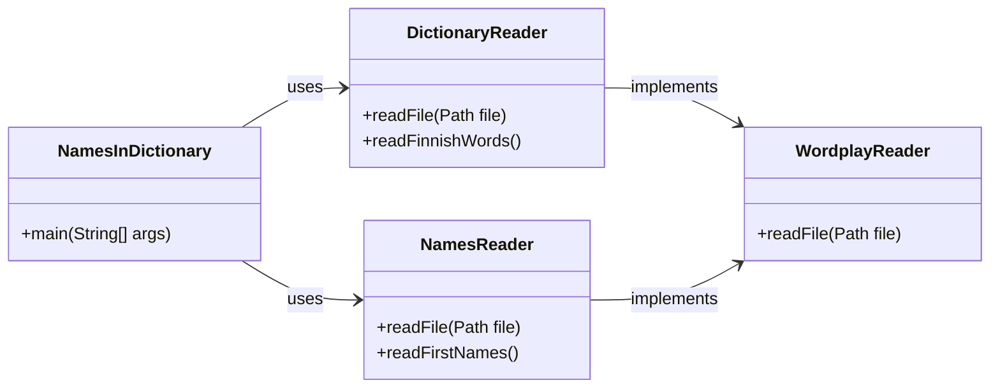

# Wordplay lesson exercise

The purpose of this exercise is to familiarize yourself with various data structures and algorithms, particularly from the perspective of their performance. We will also touch on program performance testing and the concept of ["asymptotic computational complexity"](https://en.wikipedia.org/wiki/Asymptotic_computational_complexity).

In the first part of the exercise, we will explore the performance of Java lists. In the latter part, the application to be developed will utilize open name and dictionary data and search for Finnish first names that also have another meaning in the dictionary. Examples of such names are *Tuuli* (wind) and *Onni* (happiness).

💡 *This exercise is not to be submitted or graded separately, so there is no GitHub classroom link for it. You can create your own copy of the task using either the "use this template" or "fork" functions.*

## Data used in the exercise

The Java programs in this exercise utilize several files that are in slightly different formats: the dictionary content is in plain text, while the name data is in CSV format.

The file [`kaikkisanat.txt`](./data/kaikkisanat.txt)  in the exercise package contains Finnish words in plain text in alphabetical order. The files [`etunimitilasto-naiset-ensimmainen.csv`](./data/etunimitilasto-naiset-ensimmainen.csv) and [`etunimitilasto-miehet-ensimmainen.csv`](./data/etunimitilasto-miehet-ensimmainen.csv) contain first names and their counts in [CSV format](https://en.wikipedia.org/wiki/Comma-separated_values).

Information about file copyrights and terms of use can be found further down this page under "Copyrights".

💡 *All files for this exercise are saved with [`UTF-8` character encoding](https://en.wikipedia.org/wiki/UTF-8). `UTF-8` is [the most common character encoding](https://en.wikipedia.org/wiki/Popularity_of_text_encodings), but especially in a Windows environment, your system might use a different encoding. You can find more information about character encodings in [this article](https://www.baeldung.com/java-char-encoding).*

## Part 1: performance testing of `ArrayList` and `LinkedList`

In the package [`wordplay.benchmark`](./src/main/java/wordplay/benchmark/) of this repository, you can find the classes [`ArrayListBenchmark`](./src/main/java/wordplay/benchmark/ArrayListBenchmark.java) and [`LinkedListBenchmark`](./src/main/java/wordplay/benchmark/LinkedListBenchmark.java), which contain performance tests. The performance tests illustrate significant differences between `ArrayList` and `LinkedList` in terms of data retrieval, traversal, and insertion.

The performance tests are implemented using the [Java Microbenchmark Harness (JMH)](https://github.com/openjdk/jmh) tool:

> *"JMH is a Java harness for building, running, and analysing nano/micro/milli/macro benchmarks written in Java and other languages targeting the JVM."*
>
> https://github.com/openjdk/jmh

Run the performance tests by executing the [`BenchmarkRunner`](./src/main/java/wordplay/benchmark/BenchmarkRunner.java) class either with your code editor or using Gradle:

```sh
./gradlew run      # unix
.\gradlew.bat run  # windows
```

💡 *If special characters in the output, such as &thickapprox; and <sup>-4</sup>, do not display correctly on Windows, you can try [changing the terminal's encoding](https://www.google.com/search?q=chcp+65001) to UTF-8 with the command `chcp 65001`.*

`BenchmarkRunner` executes a series of performance tests and prints information about the progress of the tests. The performance tests consist of both a warm-up phase and repeated calls to the methods being tested. The warm-up phase is important to ensure that all necessary components are loaded and the required resources are allocated from the hardware before the actual measurement. The results of the tests, i.e., the average execution time of the different methods, can be found at the end of the report once it is completed:

```
Benchmark                                              Mode  Cnt   Score    Error  Units
ArrayListBenchmark.accessArrayListWithIndex            avgt    5  ≈ 10⁻⁴            s/op
LinkedListBenchmark.accessLinkedListWithIndex          avgt    5   2.792 ±  0.118   s/op

ArrayListBenchmark.accessArrayListWithIterator         avgt    5  ≈ 10⁻⁴            s/op
LinkedListBenchmark.accessLinkedListWithIterator       avgt    5  ≈ 10⁻⁴            s/op

ArrayListBenchmark.addStringsToBeginningOfArrayList    avgt    5   0.426 ±  0.052   s/op
LinkedListBenchmark.addStringsToBeginningOfLinkedList  avgt    5   0.001 ±  0.001   s/op
```

Above, *"avgt"* means *"average time"*. *"Cnt"* refers to the number of executions, and *"score"* indicates the average duration of a single execution of the tested method. *"s/op"* is the unit, meaning seconds per method execution. A more detailed explanation of the executed methods can be found in the following paragraphs.

### Searching the list byiIndex (*accessArrayListWithIndex* and *accessLinkedListWithIndex*)

In the classes [`ArrayListBenchmark`](./src/main/java/wordplay/benchmark/ArrayListBenchmark.java) and [`LinkedListBenchmark`](./src/main/java/wordplay/benchmark/LinkedListBenchmark.java), the same operations are tested with both `ArrayList` and `LinkedList` types of lists. In the initial methods, a Finnish word list is traversed from start to finish, and for each word, its `length()` method is called.

The performance tests are *annotated* with the `@Benchmark` annotation, which allows the JMH tool to recognize them as performance tests:

```java
ArrayList<String> arrayList = new ArrayList<>(finnishWords); // 93 086 words

@Benchmark
public void accessArrayListWithIndex() {
    for (int i = 0; i < arrayList.size(); i++) {
        arrayList.get(i).length();
    }

    // average execution time of the method is 0,0001 seconds
}
```

The above code [utilizing an `ArrayList` type list](./src/main/java/wordplay/benchmark/ArrayListBenchmark.java) is almost identical to the [below `LinkedList` version](./src/main/java/wordplay/benchmark/LinkedListBenchmark.java):

```java
LinkedList<String> linkedList = new LinkedList<>(finnishWords); // 93 086 words

@Benchmark
public void accessLinkedListWithIndex() {
    for (int i = 0; i < linkedList.size(); i++) {
        linkedList.get(i).length();
    }

    // average execution time of the method is 2.792 seconds
}
```

As observed from the test results, the code that iterates through a dataset of [approximately 93,086 words](./data/kaikkisanat.txt) one by one using indices takes an average of 10<sup>-4</sup> or **0.0001 seconds** with an `ArrayList`. The same iteration with a `LinkedList` takes an average of **2.792 seconds**, which is **about 30,000 times longer**:

```
Benchmark                                           Mode  Cnt   Score    Error  Units
ArrayListBenchmark.accessArrayListWithIndex         avgt    5  ≈ 10⁻⁴            s/op
LinkedListBenchmark.accessLinkedListWithIndex       avgt    5   2.792 ±  0.118   s/op
```

In an `ArrayList` type list, searching for a specific value by index requires only one lookup operation, [because it internally uses an array](https://github.com/openjdk/jdk/blob/6aa197667ad05bd93adf3afc7b06adbfb2b18a22/src/java.base/share/classes/java/util/ArrayList.java#L133-L139). Therefore, iterating through all the values in the list requires only as many operations as the length of the list:

```java
// repeated as many times as the length of the list (n times):
for (int i = 0; i < arrayList.size(); i++) {

    // haku taulukosta vaatii vain 1 operaation
    arrayList.get(i);
}

// in total, n * 1 operations are performed: O(n)
```

In `LinkedList` type lists, elements are "in sequence" and searching for a single value from the middle [requires traversing all preceding values either from the start or the end to the desired index](https://github.com/openjdk/jdk/blob/6aa197667ad05bd93adf3afc7b06adbfb2b18a22/src/java.base/share/classes/java/util/LinkedList.java#L574-L591). For example, searching from index 10 in a linked list requires first traversing through "links/nodes" 0, 1, 2, ... 9, assuming the traversal starts from the beginning of the list.

Since Java's linked list can be traversed either [from start to end or from end to start](https://docs.oracle.com/en/java/javase/21/docs/api/java.base/java/util/LinkedList.html), the average distance of each index from the starting point is 1/4 of the list's length. Therefore, a search operation on our list of approximately 90,000 words requires traversing an average of about 22,500 "links/nodes".

```java
// operations equivalent to the length of the list (n):
for (int i = 0; i < linkedList.size(); i++) {

    // each `get` call requires an average of n/4 operations:
    linkedList.get(i);
}

// in total, approximately n * n/4 operations are performed: O(n²)
```

When evaluating performance tests and efficiency, measurement accuracy is not perfect, nor does it need to be. What is more important is understanding how the algorithm performs relative to the size of the dataset it processes. An algorithm whose operations scale with the dataset size as `n * n/4` scales as poorly as an algorithm with a ratio of `n * n` or <code>n<sup>2</sup></code>.

The durations and counts of operations are not as straightforward as presented above, but based on theory and performance tests, it strongly appears that the `LinkedList` performed **tens of thousands of times** slower than the `ArrayList` in this test with the Finnish word list dataset.

💡 *It is also important to note that as the dataset size increases, the performance difference also grows. If the list had ten times the number of elements, traversing the `ArrayList` would take ten times longer. Traversing the `LinkedList`, on the other hand, would take approximately a hundred times longer, because there would be ten times more indices to traverse. Additionally, each `get(i)` call for each index would also be, on average, ten times slower than it is currently.*

### Iterating a list (*accessArrayListWithIterator* and *accessLinkedListWithIterator*)

In the same performance test classes [`ArrayListBenchmark`](./src/main/java/wordplay/benchmark/ArrayListBenchmark.java) and [`LinkedListBenchmark`](./src/main/java/wordplay/benchmark/LinkedListBenchmark.java), there are also other test methods where the values of both `ArrayList` and `LinkedList` type lists are iterated through one by one using *iteration*:

```java
ArrayList<String> arrayList = new ArrayList<>(finnishWords);

@Benchmark
public void accessArrayListWithIterator() {
    for (String word : arrayList) {
        word.length();
    }

    //average execution time of the method is 0,0001 seconds
}
```

```java
LinkedList<String> linkedList = new LinkedList<>(finnishWords);

@Benchmark
public void accessLinkedListWithIterator() {
    for (String word : linkedList) {
        word.length();
    }

    //average execution time of the method is 0,0001 seconds
}
```

In this case, no differences in performance are observed between the lists based on the performance tests. The execution time for both methods is approximately 10<sup>-4</sup> or 0.0001 seconds:

```
Benchmark                                           Mode  Cnt   Score    Error  Units
ArrayListBenchmark.accessArrayListWithIterator      avgt    5  ≈ 10⁻⁴            s/op
LinkedListBenchmark.accessLinkedListWithIterator    avgt    5  ≈ 10⁻⁴            s/op
```

In this iteration-based solution, the same `LinkedList` performs the same task approximately 30,000 times better than in the previous index-based `get(i)` solution.

The improved performance is due to the fact that fetching the next value from a linked list requires only one operation. Although the same values were traversed in both the index-based and iteration-based solutions, using the `get(i)` method required a significant amount of extra work.

Therefore, the performance of both `ArrayList` and `LinkedList` is computationally the same when iterating through the list:

```java
// n words, each requiring only one operation:
for (String word : list) {
    word.length();
}

// Performance is O(n)
```

### Pohdittavaa

Vaikka `ArrayList` näyttää edellä esitettyjen tietojen valossa olevan ylivertainen `LinkedList`:iin verrattuna, ei asia ole suinkaan niin yksiselitteinen.

`ArrayList` suoriutuu huonosti tilanteista, joissa listan alkuun tai keskelle lisätään arvoja. Tällaisissa tilanteissa kohdeindeksin jälkeiset arvot joudutaan [kopioimaan listan taustalla olevassa taulukossa eteenpäin](https://github.com/openjdk/jdk/blob/6aa197667ad05bd93adf3afc7b06adbfb2b18a22/src/java.base/share/classes/java/util/ArrayList.java#L501-L522), mikä tarkoittaa pahimmassa tapauksessa koko taulukon sisällön kopiointia yhden pykälän eteenpäin. Vastaavasti `ArrayList`:in taustalla olevan taulukon täyttyessä se joudutaan korvaamaan uudella, suuremmalla taulukolla, mikä on myös suorituskyvyn kannalta raskas operaatio. `LinkedList`-tyyppisten listojen kohdalla olemassa olevia arvoja ei jouduta siirtämään.

Tutustu itsenäisesti [`addStringsToBeginningOfArrayList`](./src/main/java/wordplay/benchmark/ArrayListBenchmark.java)- ja [`addStringsToBeginningOfLinkedList`](./src/main/java/wordplay/benchmark/LinkedListBenchmark.java)-metodien toteutukseen ja niiden suorituskykyyn.

### Considerations

Although `ArrayList` appears to be superior to `LinkedList` based on the information presented above, the situation is not so straightforward.

`ArrayList` performs poorly in situations where values are added to the beginning or middle of the list. In such cases, the values following the target index need to be [copied forward in the underlying array](https://github.com/openjdk/jdk/blob/6aa197667ad05bd93adf3afc7b06adbfb2b18a22/src/java.base/share/classes/java/util/ArrayList.java#L501-L522), which can mean copying the entire array's contents one step forward in the worst case. Similarly, when the underlying array of an `ArrayList` becomes full, it needs to be replaced with a new, larger array, which is also a performance-intensive operation. In `LinkedList` type lists, existing values do not need to be moved.

Explore the implementations and performance of the [`addStringsToBeginningOfArrayList`](./src/main/java/wordplay/benchmark/ArrayListBenchmark.java) and [`addStringsToBeginningOfLinkedList`](./src/main/java/wordplay/benchmark/LinkedListBenchmark.java) methods independently.

```
Benchmark                                              Mode  Cnt   Score    Error  Units
ArrayListBenchmark.addStringsToBeginningOfArrayList    avgt    5   0.426 ±  0.052   s/op
LinkedListBenchmark.addStringsToBeginningOfLinkedList  avgt    5   0.001 ±  0.001   s/op
```

🚀 *You can also write additional performance tests if you wish, experimenting with different cases where various types of collections perform differently.*

## Osa 2: Koodaustehtävä

Tässä Git-repositoriossa on tiedosto [kaikkisanat.txt](./data/kaikkisanat.txt), joka sisältää [Kotimaisten kielten keskuksen nykysuomen sanalistan](https://kaino.kotus.fi/sanat/nykysuomi/):

```
aakkonen
aakkosellinen
aakkosellisesti
aakkosellisuus
...
```

Repositorio sisältää myös tiedostot [etunimitilasto-naiset-ensimmainen.csv](./data/etunimitilasto-naiset-ensimmainen.csv) sekä [etunimitilasto-miehet-ensimmainen.csv](./data/etunimitilasto-miehet-ensimmainen.csv), joista löytyy [Digi- ja väestötietoviraston nimiaineistoissa](https://www.avoindata.fi/data/fi/organization/digi_ja_vaestotietovirasto) esiintyvät etunimet sekä niitä vastaavat lukumäärät:

```
Etunimi;Lukumäärä
Anne;30 204
Tuula;30 113
Päivi;29 789
Anna;28 677
Leena;27 745
...
```

Näiden tiedostojen lukemiseksi on olemassa valmiit metodit [`NamesReader.readFirstNames()`](./src/main/java/wordplay/io/NamesReader.java) sekä [`DictionaryReader.readFinnishWords()`](./src/main/java/wordplay/io/DictionaryReader.java), jotka palauttavat tiedostojen sisällöt listoina.


### Ohjelman rakenne

Koska tiedostoja on kahta eri tyyppiä, projektiin on toteutettu kaksi erillistä luokkaa niiden lukemiseksi: [DictionaryReader](./src/main/java/wordplay/io/DictionaryReader.java) ja [NamesReader](./src/main/java/wordplay/io/NamesReader.java). Molemmat luokat toteuttavat [WordplayReader](./src/main/java/wordplay/io/WordplayReader.java)-rajapinnan, jossa on määritettynä `readFile`-metodi:



Yhteisen `readFile`-metodin lisäksi `NamesReader`- ja `DictionaryReader`-luokilla on omat apumetodit juuri niiden käsittelemien tiedostojen lukemiseksi:

```java
List<String> finnishNames = NamesReader.readFirstNames();
List<String> finnishWords = DictionaryReader.readFinnishWords();
```

Sinun ei tarvitse toteuttaa tiedostojen käsittelyä itse, vaan voit hyödyntää edellä mainittuja metodeita.


### [`NamesInDictionary`-luokka](./src/main/java/wordplay/NamesInDictionary.java)

Tässä tehtävässä sinun tulee täydentää [`NamesInDictionary`-luokkaan](./src/main/java/wordplay/NamesInDictionary.java) `main`-metodi, joka käy molemmat edellää esitellyt aineistot läpi ja **tulostaa sellaiset suomenkieliset nimet, jotka löytyvät myös sanakirjasta**. Et saa tulostaa nimiä, jotka löytyvät ainoastaan osana jotain pidempää sanaa. Esimerkiksi nimi *Antti* löytyy osana sanoja kuten "elef*antti*" ja "deodor*antti*", mutta ei yksinään.

Voit toteuttaa ratkaisusi esimerkiksi toistorakenteella sekä listan `contains()`-metodilla. Vaihtoehtoisesti tehtävän voi ratkaista myös kahdella sisäkkäisellä toistolla ja `equalsIgnoreCase`-metodilla. Riippumatta kumman lähestymistavan valitset, tulee ratkaisu todennäköisesti olemaan melko hidas, koska jokaista nimeä (`n=15 665`) kohden joudutaan käymään läpi kaikki sanalistan sanat (`m=93 086`). Tämä ratkaisu vaatisi siis `n * m` operaatiota, joka tarkoittaa näiden aineistojen kanssa peräti 1&nbsp;458&nbsp;192&nbsp;190 vertailuoperaatiota.

Vaikka tietokoneesi olisi tehokas, vie listoja läpikäyvä ja kaikkia sanoja vertaileva ["brute force"](https://en.wikipedia.org/wiki/Brute-force_search)-ratkaisu todennäköisesti useita sekunteja.

Kurssilla käsitellyn `HashMap`-tietorakenteen käyttäminen osana tätä ratkaisua voi olla kannattavaa. Voit tutustaua myös [`HashSet`-tietorakenteeseen](https://docs.oracle.com/en/java/javase/17/docs/api/java.base/java/util/HashSet.html), jonka toimintaperiaate on samankaltainen kuin `HashMap`:illa, mutta avain-arvo-parien sijasta siihen tallennetaan vain yksittäisiä arvoja. Listan `contains()`-metodi vaatii koko listan läpikäynnin, kun taas `HashMap`:in `containsKey` vaatii vain yhden operaation ([baeldung.com](https://www.baeldung.com/java-treemap-vs-hashmap)).

⏱ *Jos ohjelmasi tuottaa oikean ratkaisun sekunnin kymmenesosissa, on se todennäköisesti tehokkaasti toteutettu.*

💡 *Huomaa, että nimien ja sanakirjan sanojen kirjainkoko ei ole sama. Nimitiedostossa esimerkiksi `"Tuuli"` on kirjoitettu isolla alkukirjaimella, kun sanakirjassa se on kirjoitettu pienellä `"tuuli"`.*


### Oikea ratkaisu

Tieto sanalistasta löytyvien nimien määrästä löytyy oheisesta tiedostosta [ratkaisu.md](./ratkaisu.md).


# Tekijänoikeudet

## Kotimaisten kielten keskuksen nykysuomen sanalista

Harjoituksessa hyödynnetään [Kotimaisten kielten keskuksen nykysuomen sanalistaa](https://kaino.kotus.fi/sanat/nykysuomi/):

> *"Kotimaisten kielten keskus julkaisee taivutustiedoin täydennetyn nykysuomen sanalistan. Sanalista ei ole tyhjentävä tai auktoritatiivinen luettelo suomen kielen sanoista, vaan sen on tarkoitus mm. toimia apuvälineenä suomen kieltä käsittelevien tietokoneohjelmien ja suomenkielisten käyttöliittymien kehitystyössä. Sanalista perustuu pääosin CD-Perussanakirjan sanastoon."*
>
> *"Sanalista julkaistaan lisensseillä GNU LGPL (Lesser General Public License), EUPL v.1.1 (Euroopan unionin yleinen lisenssi) ja CC Nimeä 3.0."*
>
>  Kotimaisten kielten keskus. Kotimaisten kielten keskuksen nykysuomen sanalista. https://kaino.kotus.fi/sanat/nykysuomi/

[GNU LGPL -lisenssi](http://www.gnu.org/licenses/lgpl.html), [EUPL v.1.1 -lisenssi](http://joinup.ec.europa.eu/software/page/eupl/licence-eupl), [Creative Commons Nimeä 3.0 -lisenssi](http://creativecommons.org/licenses/by/3.0/deed.fi)

Harjoituksessa hyödynnetty muokattu versio, jossa XML:n sijasta sanat ovat raakatekstinä, on lainattu [Hugo van Kemenaden](https://github.com/hugovk) GitHub-projektista [Every Finnish Word](https://github.com/hugovk/everyfinnishword).


## Väestötietojärjestelmän suomalaisten nimiaineistot

> *"[Digi- ja väestötietovirasto (DVV)](https://www.avoindata.fi/data/fi/organization/digi_ja_vaestotietovirasto) on julkaissut tietoaineiston [Väestötietojärjestelmän suomalaisten nimiaineistot](https://www.avoindata.fi/data/fi/dataset/none) lisenssillä [Creative Commons Attribution 4.0 International License](https://creativecommons.org/licenses/by/4.0/).*"
>
> Väestötietojärjestelmän suomalaisten nimiaineistot. https://www.avoindata.fi/data/fi/dataset/none


## Tämä harjoitus

Tämän harjoituksen on kehittänyt Teemu Havulinna ja se on lisensoitu [Creative Commons BY-NC-SA -lisenssillä](https://creativecommons.org/licenses/by-nc-sa/4.0/).

Harjoituksenannon, käsiteltävien tiedostojen sekä lähdekoodien toteutuksessa on hyödynnetty ChatGPT 3.5:ttä sekä GitHub copilot -tekoälyavustinta.
