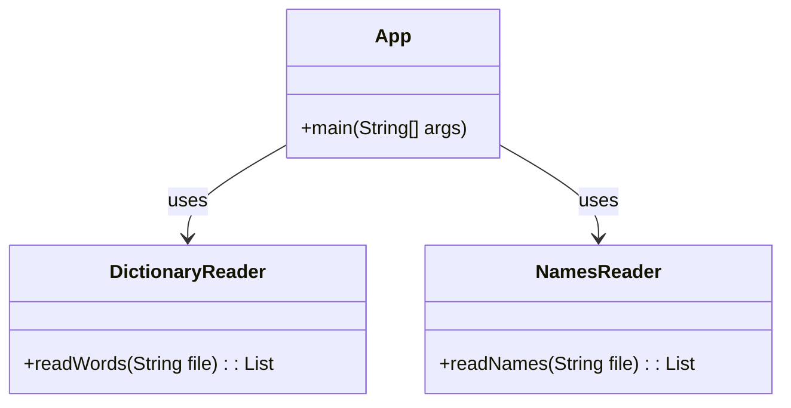

# Wordplay - etsi etunimet sanakirjasta

Tämän tehtävän tarkoituksena on tutustua kurssilla käytettäviin työkaluihin sekä kerrata ohjelmointitaitoja luokkien, merkkijonojen, toistorakenteiden ja listojen parissa.

Tehtävässä kehitettävän sovelluksen tarkoituksena on hyödyntää avointa nimi- ja sanakirja-aineistoa ja etsiä sellaisia etunimiä, joilla on myös jokin toinen merkitys.

Tehtävä koostuu useammasta osasta, jotka arvioidaan erikseen. Ennen oman toteutuksen aloittamista varmista, että saat suoritettua tehtäväpohjassa valmiina olevan koodin ongelmitta `run`-komennolla:

```
./gradlew run       # unix
gradlew.bat run     # windows
```

Onnistuneen suorituksen jälkeen saat seuraavan kaltaisen tulosteen:

```
> Task :run
The first word in the file is aakkonen
The last word in the file is öylätti

BUILD SUCCESSFUL in 2s
2 actionable tasks: 2 executed
```

Tulosteessa näkyy, että tehtäväpohjassa oleva [`App.java`](./src/main/java/wordplay/App.java)-luokka käännettiin ja suoritettiin onnistuneesti, ja että [`kaikkisanat.txt`](./data/kaikkisanat.txt)-tiedoston sisältö saatiin luettua onnistuneesti.

💡 Ensimmäisellä suorituskerralla suoritus saattaa olla hyvin hidas, mutta suoritus nopeutuu seuraavilla kerroilla. Voit myös vaihtoehtoisesti suorittaa ohjelmasi käyttämäsi koodieditorin "run"-painikkeella.


## Tehtävässä käytettävä data

Ohjelmasi tarvitsee suoritukseen useita tiedostoja, jotka ovat hieman poikkeavissa muodoissa: raakatekstinä ja CSV:nä.

[`data/kaikkisanat.txt`](./data/kaikkisanat.txt) sisältää suomenkielisiä sanoja raakatekstinä aakkosjärjestyksessä, esimerkiksi seuraavasti:

```
aakkonen
aakkosellinen
aakkosellisesti
aakkosellisuus
```

Etunimitiedostot [`data/etunimitilasto-naiset-ensimmainen.csv`](./data/etunimitilasto-naiset-ensimmainen.csv) sekä [`data/etunimitilasto-miehet-ensimmainen.csv`](./data/etunimitilasto-miehet-ensimmainen.csv) sisältävät puolestaan etunimiä seuraavassa muodossa:

```
Etunimi;Lukumäärä
Anne;30 204
Tuula;30 113
Päivi;29 789
Anna;28 677
Leena;27 745
```

Tiedostot sisältävät ensimmäisellä rivillä otsikot `Etunimi;Lukumäärä`. Seuraavat datarivit koostuvat puolipisteellä (`;`) erotellusta nimestä ja nimeä vastaavasta lukumäärästä väestörekisterissä.

💡 Huom! Et saa tämän tehtävän puitteissa tehdä muutoksia näihin tiedostoihin.


## Ohjelman rakenne

Koska tiedostoja on kahta eri tyyppiä, tehtävässä on mukana kaksi eri luokkaa niiden lukemiseksi ja käsittelemiseksi. Saat halutessasi luoda vapaasti uusia apuluokkia ja -metodeja. Huomaa kuitenkin, että automaattisten testien vuoksi tehtävänannossa määrätyt luokat ja metodit tulee toteuttaa ohjeiden mukaisesti.



Sanakirjan sanat lukeva `DictionaryReader`-luokka on [annettu tehtäväpohjassa valmiina](./src/main/java/wordplay/DictionaryReader.java). Luokka lukee tiedoston sisällön hyödyntäen Javan [Files](https://docs.oracle.com/javase/9/docs/api/java/nio/file/Files.html)- sekä [Path](https://docs.oracle.com/javase/9/docs/api/java/nio/file/Path.html)-luokkia, kuten [ohjelmointi 1 -kurssin esimerkissä](https://ohjelmointi1.github.io/docs/13_tiedostot/#tiedoston-lukeminen).


## Osa 1: nimitiedostojen lukeminen

Tehtävänäsi on jatkokehittää tehtäväpohjan [NamesReader](./src/main/java/wordplay/NamesReader.java)-luokkaa siten, että sen `readNames`-metodi lukee vastaavalla tavalla sille annetun nimiä sisältävän tiedoston ja palauttaa nimet listana yksittäisiä merkkijonoja. Metodi saa siis esimerkiksi parametrinaan tiedoston nimen `"etunimitilasto-naiset-ensimmainen.csv"` ja palauttaa listan kyseisen tiedoston sisältämistä nimistä, esim. `["Anne", "Tuula", "Päivi", "Anna", "Leena"]`. Logiikan tulee toimia vastaavasti myös muiden tiedostojen kanssa, kuten `"etunimitilasto-miehet-ensimmainen.csv"`.

Voit halutessasi tehdä oman main-metodin, jossa kokeilet kirjoittamasi koodin toimivuutta. Voit myös hyödyntää valmista JUnit-testiä [NamesReaderTest](./src/test/java/wordplay/NamesReaderTest.java), joka löytyy tehtäväpohjasta ja jolla ratkaisusi tarkastetaan palautuksen jälkeen. Voit suorittaa testin joko koodieditorisi käyttöliittymän kautta tai komennolla:

```
./gradlew test --tests NamesReaderTest      # unix
gradlew.bat test --tests NamesReaderTest    # windows
```

💡 Jos testi ei mene läpi, kokeile suorittaa komento uudestaan siten, että lisäät loppuun argumentin `--info`. Näin saat tarkemman tiedon siitä, mikä testissä meni pieleen. Voit myös avata HTML-muotoisen testiraportin, joka kertoo lisätietoja virheestä. Vaihtoehtoisesti voit suorittaa testit koodieditorisi testauspainikkeilla.


## Osa 2: pääohjelma ja nimien etsiminen sanakirjasta

Kun [`NamesReader`](./src/main/java/wordplay/NamesReader.java)-luokkasi toimii ja läpäisee sille kirjoitetun testin, on aika toteuttaa varsinainen pääohjelma. Pääohjelma kirjoitetaan [`App.java`](./src/main/java/wordplay/App.java)-luokkaan.

Pääohjelmasi tulee hyödyntää edellä mainittuja DictionaryReader- ja NamesReader-luokkia lukeakseen sekä etunimet että sanakirjan. Tämän jälkeen ohjelman tulee tarkastaa, mitkä etunimet löytyvät sanakirjasta ja tulostaa aakkosjärjestyksessä. Et saa tulostaa nimiä, jotka eivät löydy sellaisenaan sanakirjasta. Esimerkiksi nimeä *Ran* ei löydy sanakirjasta, joten sitä ei tulosteta, vaikka se löytyisikin osana useita muita sanoja.

Voit suorittaa pääohjelman joko koodieditorisi käyttöliittymän kautta tai komennolla:

```
./gradlew run       # unix
gradlew.bat run     # windows
```

Gradle osaa suorittaa `run`-komennolla oikean pääohjelman, koska `wordplay.App` on määritetty [build.gradle](./build.gradle)-tiedostossa pääohjelmaksi.

```groovy
application {
    mainClass = 'wordplay.App'
}
```

💡 Huomaa, että tiedostojen kirjainkoko vaihtelee. Nimitiedostossa esimerkiksi `"Tuuli"` on kirjoitettu isolla alkukirjaimella, kun sanakirjassa se on kirjoitettu pienellä `"tuuli"`.

## Osa 3: ohjelman paketointi JAR-tiedostoksi

Kun olet saanut pääohjelman toimimaan, paketoi koko ohjelma suoritettavaksi [jar-paketiksi](https://en.wikipedia.org/wiki/JAR_(file_format)).

Tämä onnistuu kätevimmin Gradle-komennolla `build`:

```
./gradlew build         # unix
gradlew.bat build       # windows
```

Build-komento kääntää Java-luokkasi, ajaa testit ja luo JAR-paketin, joka sijaitsee hakemistossa [build/libs](./build/libs/).

Kokeile suorittaa jar-paketti komennolla:

```
java -jar build/libs/wordplay-exercise.jar  # unix
java -jar build\libs\wordplay-exercise.jar  # windows
```

Kopioi lopuksi `wordplay-exercise.jar`-tiedostosi projektin päähakemistoon, eli samaan hakemistoon, jossa tämä `readme.md` sijaitsee. Lisää tiedosto myös versionhallintaan `git add`- ja `git commit`-komennoilla, jotta se huomioidaan tehtävän arvioinnissa.

💡 Huom! `java -jar`-komento tulee suorittaa projektin päähakemistossa, jotta ohjelma löytää luettavat csv- ja txt-tiedostot.


# Tekijänoikeudet

## Kotimaisten kielten keskuksen nykysuomen sanalista

Tehtävässä hyödynnetään Kotimaisten kielten keskuksen nykysuomen sanalistaa. Tehtävässä hyödynnetty muokattu versio, jossa XML:n sijasta sanat ovat raakatekstinä, on lainattu [Hugo van Kemenaden](https://github.com/hugovk) GitHub-projektista [Every Finnish Word](https://github.com/hugovk/everyfinnishword).


> *"Kotimaisten kielten keskus julkaisee taivutustiedoin täydennetyn nykysuomen sanalistan. Sanalista ei ole tyhjentävä tai auktoritatiivinen luettelo suomen kielen sanoista, vaan sen on tarkoitus mm. toimia apuvälineenä suomen kieltä käsittelevien tietokoneohjelmien ja suomenkielisten käyttöliittymien kehitystyössä. Sanalista perustuu pääosin CD-Perussanakirjan sanastoon."*
>
> *"Sanalista julkaistaan lisensseillä GNU LGPL (Lesser General Public License), EUPL v.1.1 (Euroopan unionin yleinen lisenssi) ja CC Nimeä 3.0."*
>
>  Kotimaisten kielten keskus. Kotimaisten kielten keskuksen nykysuomen sanalista. https://kaino.kotus.fi/sanat/nykysuomi/


## Väestötietojärjestelmän suomalaisten nimiaineistot

> *"[Digi- ja väestötietovirasto (DVV)](https://www.avoindata.fi/data/fi/organization/digi_ja_vaestotietovirasto) on julkaissut tietoaineiston [Väestötietojärjestelmän suomalaisten nimiaineistot](https://www.avoindata.fi/data/fi/dataset/none) lisenssillä [Creative Commons Attribution 4.0 International License](https://creativecommons.org/licenses/by/4.0/).*"
>
> Väestötietojärjestelmän suomalaisten nimiaineistot. https://www.avoindata.fi/data/fi/dataset/none
