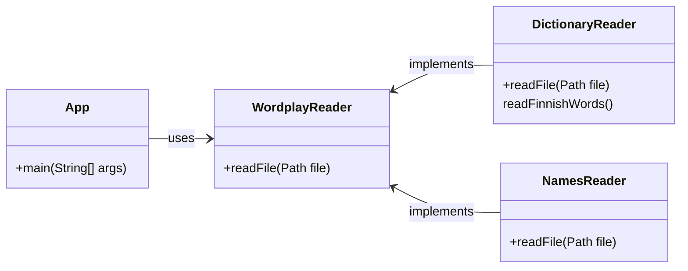

# Wordplay-tuntiharjoitus

Tämän harjoituksen tarkoituksena on perehtyä erilaisiin ennalta tuttuihin tietorakenteisiin ja algoritmeihin ja perehtyä syvällisemmin siihen, miten ne toimivat.

Harjoituksessa kehitettävä sovellus hyödyntää avointa nimi- ja sanakirja-aineistoa ja etsii mm. sellaisia etunimiä, joilla on nimen lisäksi myös jokin merkitys sanakirjassa. Tällaisia nimiä ovat esimerkiksi *Tuuli* ja *Onni*.

💡 *Tätä tehtävää ei erikseen palauteta eikä arvioida, joten sitä varten ei ole GitHub classroom -linkkiä. Voit luoda tehtävästä oman kopion joko "use this template"- tai "fork"-toiminnoilla.*


## Harjoituksessa käytettävä data

Tämän harjoituksen Java-ohjelma hyödyntää useita tiedostoja, jotka ovat hieman poikkeavissa muodoissa: sanakirjan sisältö on raakatekstinä, kun taas nimiaineisto on csv-muodossa.

[`data/kaikkisanat.txt`](./data/kaikkisanat.txt) sisältää suomenkielisiä sanoja raakatekstinä aakkosjärjestyksessä kun taas etunimitiedostot [`etunimitilasto-naiset-ensimmainen.csv`](./data/etunimitilasto-naiset-ensimmainen.csv) sekä [`etunimitilasto-miehet-ensimmainen.csv`](./data/etunimitilasto-miehet-ensimmainen.csv) sisältävät etunimiä sekä niiden lukumääriä [CSV-muodossa](https://fi.wikipedia.org/wiki/CSV).

Tiedot tiedostojen tekijänoikeuksista ja käyttöehdoista tältä sivulta kohdasta [Tekijänoikeudet](#tekijänoikeudet).

💡 *Huom! Kaikki tämän harjoituksen tiedostot on tallennettu [`UTF-8`-merkistökoodauksella](https://en.wikipedia.org/wiki/UTF-8). `UTF-8` on tänä päivänä yleisin merkistökoodaus, mutta erityisesti Windows-ympäristössä järjestelmäsi saattaa käyttää jotain muuta merkistöä. [Lisätietoja merkistöistä (baeldung.com)](https://www.baeldung.com/java-char-encoding).*


## Ohjelman rakenne

Koska tiedostoja on kahta eri tyyppiä, projektiin on toteutettu kaksi erillistä luokkaa niiden lukemiseksi: [DictionaryReader](./src/main/java/wordplay/io/DictionaryReader.java) ja [NamesReader](./src/main/java/wordplay/io/NamesReader.java). Molemmat luokat toteuttavat [WordplayReader](./src/main/java/wordplay/io/WordplayReader.java)-rajapinnan, jossa on määritettynä `readFile`-metodi:



## Osa 1: `ArrayList` ja `LinkedList`


## Osa 1: sanakirjan sisällön lukeminen *(perusteet, 30 %)*

Perehdy [Reader](./src/main/java/wordplay/Reader.java)-rajapintaan ja jatkokehitä [DictionaryReader](./src/main/java/wordplay/DictionaryReader.java)-luokkaa siten, että se toteuttaa kyseisen rajapinnan. DictionaryReader-luokan `readFile`-metodin tulee lukea tiedosto sille annetusta polusta ja palauttaa tiedoston sisältö pilkottuna listaksi erillisiä merkkijonoja. [Sanakirjatiedostossa](./data/kaikkisanat.txt) jokainen sana on omalla rivillään, joten käytännössä riittää, että luet tiedoston ja palautat sen rivit listana:

```
aakkonen
aakkosellinen
aakkosellisesti
aakkosellisuus
```

Voit halutessasi tehdä oman main-metodin, jossa kokeilet kirjoittamasi koodin toimivuutta. Voit myös hyödyntää valmista JUnit-testiä [DictionaryReaderTest](./src/test/java/wordplay/DictionaryReaderTest.java). Voit suorittaa testin joko koodieditorisi käyttöliittymän kautta tai Gradlen avulla komennolla:

```
./gradlew test --tests DictionaryReaderTest      # unix
gradlew.bat test --tests DictionaryReaderTest    # windows
```

💡 *Jos Gradle-testi ei mene läpi, kokeile suorittaa komento uudestaan siten, että lisäät loppuun argumentin `--info`. Näin saat tarkemman tiedon siitä, mikä testissä meni pieleen. Gradlen tulosteessa kerrotaan myös HTML-muotoisen testiraportin sijainti, josta voit lukea tarkempia tietoja testien tuloksista.*

💡 *Sinun ei vielä tässä vaiheessa tarvitse perehtyä varsinaisen testin tekniseen toteutukseen. Tässä vaiheessa riittää, että suoritat testin ja tutustut sen mahdollisesti tuottamiin virheilmoituksiin.*


## Osa 2: nimitiedostojen sisällön lukeminen *(perusteet, 30 %)*

Seuraavaksi toteuta [NamesReader](./src/main/java/wordplay/NamesReader.java)-luokka siten, että myös se toteuttaa [Reader](./src/main/java/wordplay/Reader.java)-rajapinnan.

Tämän luokan tulee osata lukea tiedosto, kuten [`etunimitilasto-naiset-ensimmainen.csv`](./data/etunimitilasto-naiset-ensimmainen.csv) ja palauttaa listan kyseisen tiedoston sisältämistä nimistä, esim. `["Anne", "Tuula", "Päivi", "Anna", "Leena"]`.

[Digi- ja väestötietoviraston nimiaineistoissa](https://www.avoindata.fi/data/fi/organization/digi_ja_vaestotietovirasto) on ensimmäisellä rivillä otsikot ja jokaisella datarivillä nimen lisäksi lukumäärä, joita ei saa olla mukana palautettavalla listalla:

```
Etunimi;Lukumäärä
Anne;30 204
Tuula;30 113
Päivi;29 789
Anna;28 677
Leena;27 745
```

Ratkaisusi tulee toimia vastaavasti myös muiden samanmuotoisten tiedostojen kanssa, kuten [`etunimitilasto-miehet-ensimmainen.csv`](./data/etunimitilasto-miehet-ensimmainen.csv).

Voit halutessasi tehdä oman main-metodin, jossa kokeilet kirjoittamasi koodin toimivuutta. Voit myös hyödyntää valmista JUnit-testiä [NamesReaderTest](./src/test/java/wordplay/NamesReaderTest.java), joka löytyy projektipohjasta ja jolla ratkaisusi tarkastetaan palautuksen jälkeen. Voit suorittaa testin joko koodieditorisi käyttöliittymän kautta tai komennolla:

```
./gradlew test --tests NamesReaderTest      # unix
gradlew.bat test --tests NamesReaderTest    # windows
```


## Osa 3: pääohjelma ja nimien etsiminen sanakirjasta *(perusteet, 30 %)*

Molemmat luokkasi toimivat ja läpäisevät niille kirjoitetut testit, on aika toteuttaa varsinainen pääohjelma. Pääohjelma kirjoitetaan [`App.java`](./src/main/java/wordplay/App.java)-luokkaan.

Pääohjelmasi tulee hyödyntää edellä mainittuja `DictionaryReader`- ja `NamesReader`-luokkia lukeakseen miesten ja naisten etunimet sekä sanakirjan. Tämän jälkeen ohjelman tulee tarkastaa, mitkä etunimet löytyvät sanakirjasta ja tulostaa ne aakkosjärjestyksessä. Et saa tulostaa nimiä, jotka löytyvät vain osana jotain sanaa. Esimerkiksi nimi *Ran* löytyy osana sanoja, kuten "bume**ran**gi" ja "deodo**ran**tti", mutta ei sellaisenaan.

Voit suorittaa pääohjelman joko koodieditorisi käyttöliittymän kautta tai komennolla:

```
./gradlew run       # unix
gradlew.bat run     # windows
```

Gradle osaa suorittaa `run`-komennolla oikean pääohjelman, koska `wordplay.App` on määritetty [build.gradle](./build.gradle)-tiedostossa pääohjelmaksi.

```groovy
application {
    mainClass = 'wordplay.App'
}
```

💡 *Huomaa, että nimien ja sanakirjan sanojen kirjainkoko ei ole sama. Nimitiedostossa esimerkiksi `"Tuuli"` on kirjoitettu isolla alkukirjaimella, kun sanakirjassa se on kirjoitettu pienellä `"tuuli"`.*

🐌 *Saatat huomata ohjelmaa suorittaessasi, että se toimii yllättävän hitaasti. Kyse ei ole todennäköisesti tietokoneesi suorituskyvystä, vaan hitaasta algoritmista.*

🚀 *Mikäli ohjelma toimii hitaasti, johtuu se todennäköisesti valtavasta määrästä merkkijonojen vertailuoperaatioita. Mieti miten saat minimoitua vertailuoperaatioiden ja kirjainkokoa huomioivien operaatioiden määrän.*


## Osa 4: ohjelman paketointi JAR-tiedostoksi *(perusteet, 10 %)*

Kun olet saanut pääohjelman toimimaan, paketoi koko ohjelma suoritettavaksi [jar-paketiksi](https://en.wikipedia.org/wiki/JAR_(file_format)).

Tämä onnistuu kätevimmin Gradle-komennolla `build`:

```
./gradlew build         # unix
gradlew.bat build       # windows
```

Build-komento kääntää Java-luokkasi, ajaa testit ja luo JAR-paketin, joka sijaitsee hakemistossa [build/libs](./build/libs/).

Kokeile suorittaa jar-paketti komennolla:

```
java -jar build/libs/wordplay-exercise.jar  # unix
java -jar build\libs\wordplay-exercise.jar  # windows
```

Kopioi lopuksi `wordplay-exercise.jar`-tiedostosi projektin päähakemistoon, eli samaan hakemistoon, jossa tämä `readme.md` sijaitsee. Lisää tiedosto myös versionhallintaan `git add`- ja `git commit`-komennoilla, jotta se huomioidaan harjoituksen arvioinnissa.

💡 *Huom! `java -jar`-komento tulee suorittaa projektin päähakemistossa, jotta ohjelma löytää luettavat csv- ja txt-tiedostot.*


# Tekijänoikeudet

## Kotimaisten kielten keskuksen nykysuomen sanalista

Harjoituksessa hyödynnetään [Kotimaisten kielten keskuksen nykysuomen sanalistaa](https://kaino.kotus.fi/sanat/nykysuomi/):

> *"Kotimaisten kielten keskus julkaisee taivutustiedoin täydennetyn nykysuomen sanalistan. Sanalista ei ole tyhjentävä tai auktoritatiivinen luettelo suomen kielen sanoista, vaan sen on tarkoitus mm. toimia apuvälineenä suomen kieltä käsittelevien tietokoneohjelmien ja suomenkielisten käyttöliittymien kehitystyössä. Sanalista perustuu pääosin CD-Perussanakirjan sanastoon."*
>
> *"Sanalista julkaistaan lisensseillä GNU LGPL (Lesser General Public License), EUPL v.1.1 (Euroopan unionin yleinen lisenssi) ja CC Nimeä 3.0."*
>
>  Kotimaisten kielten keskus. Kotimaisten kielten keskuksen nykysuomen sanalista. https://kaino.kotus.fi/sanat/nykysuomi/

[GNU LGPL -lisenssi](http://www.gnu.org/licenses/lgpl.html), [EUPL v.1.1 -lisenssi](http://joinup.ec.europa.eu/software/page/eupl/licence-eupl), [Creative Commons Nimeä 3.0 -lisenssi](http://creativecommons.org/licenses/by/3.0/deed.fi)

Harjoituksessa hyödynnetty muokattu versio, jossa XML:n sijasta sanat ovat raakatekstinä, on lainattu [Hugo van Kemenaden](https://github.com/hugovk) GitHub-projektista [Every Finnish Word](https://github.com/hugovk/everyfinnishword).


## Väestötietojärjestelmän suomalaisten nimiaineistot

> *"[Digi- ja väestötietovirasto (DVV)](https://www.avoindata.fi/data/fi/organization/digi_ja_vaestotietovirasto) on julkaissut tietoaineiston [Väestötietojärjestelmän suomalaisten nimiaineistot](https://www.avoindata.fi/data/fi/dataset/none) lisenssillä [Creative Commons Attribution 4.0 International License](https://creativecommons.org/licenses/by/4.0/).*"
>
> Väestötietojärjestelmän suomalaisten nimiaineistot. https://www.avoindata.fi/data/fi/dataset/none


## Tämä harjoitus

Tämän harjoituksen on kehittänyt Teemu Havulinna ja se on lisensoitu [Creative Commons BY-NC-SA -lisenssillä](https://creativecommons.org/licenses/by-nc-sa/4.0/).

Harjoituksenannon, käsiteltävien tiedostojen sekä lähdekoodien toteutuksessa on hyödynnetty ChatGPT 3.5:ttä sekä GitHub copilot -tekoälyavustinta.
