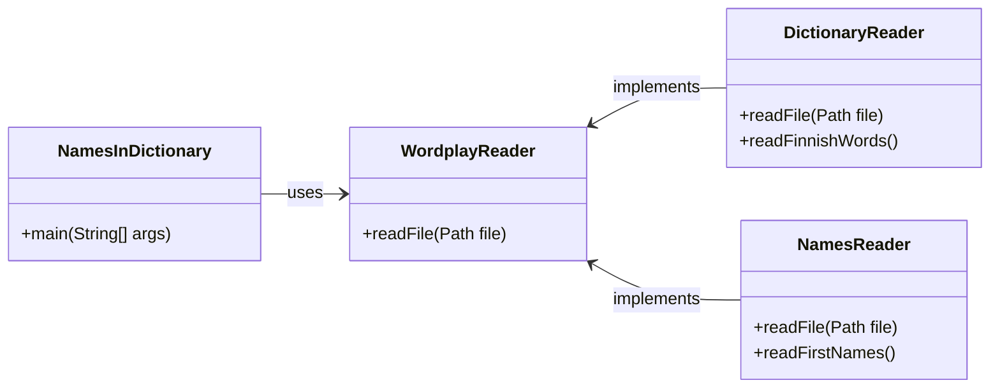

# Wordplay-tuntiharjoitus

Tämän harjoituksen tarkoituksena on perehtyä erilaisiin tietorakenteisiin ja algoritmeihin erityisesti niiden suorituskyvyn näkökulmasta.

Harjoituksessa kehitettävä sovellus hyödyntää avointa nimi- ja sanakirja-aineistoa ja etsii sellaisia suomenkielisiä etunimiä, joilla on nimen lisäksi myös jokin toinen merkitys sanakirjassa. Tällaisia nimiä ovat esimerkiksi *Tuuli* ja *Onni*.

💡 *Tätä harjoitusta ei erikseen palauteta eikä arvioida, joten sitä varten ei ole GitHub classroom -linkkiä. Voit luoda tehtävästä oman kopion joko "use this template"- tai "fork"-toiminnoilla.*


## Harjoituksessa käytettävä data

Tämän harjoituksen Java-ohjelmat hyödyntävät useita tiedostoja, jotka ovat hieman poikkeavissa muodoissa: sanakirjan sisältö on raakatekstinä, kun taas nimiaineisto on csv-muodossa.

[`data/kaikkisanat.txt`](./data/kaikkisanat.txt) sisältää suomenkielisiä sanoja raakatekstinä aakkosjärjestyksessä kun taas etunimitiedostot [`etunimitilasto-naiset-ensimmainen.csv`](./data/etunimitilasto-naiset-ensimmainen.csv) sekä [`etunimitilasto-miehet-ensimmainen.csv`](./data/etunimitilasto-miehet-ensimmainen.csv) sisältävät etunimiä sekä niiden lukumääriä [CSV-muodossa](https://fi.wikipedia.org/wiki/CSV).

Tiedot tiedostojen tekijänoikeuksista ja käyttöehdoista tältä sivulta kohdasta [Tekijänoikeudet](#tekijänoikeudet).

💡 *Kaikki tämän harjoituksen tiedostot on tallennettu [`UTF-8`-merkistökoodauksella](https://en.wikipedia.org/wiki/UTF-8). `UTF-8` on tänä päivänä yleisin merkistökoodaus, mutta erityisesti Windows-ympäristössä järjestelmäsi saattaa käyttää jotain muuta merkistöä. Lisätietoja merkistöistä löydät esimerkiksi [tästä artikkelista](https://www.baeldung.com/java-char-encoding).*


## Osa 1: `ArrayList`:in ja `LinkedList`:in suorituskykytestaus

Paketissa [`java.wordplay.benchmark`](./src/main/java/wordplay/benchmark/) löytyy luokkia suorituskykytestien suorittamiseksi. Suorituskykytestit havainnollistavat merkittäviä eroja `ArrayList`:in sekä `LinkedList`:in välillä, mutta niistä ilmenee myös merkittäviä suorituskykyeroja eri iterointitapojen välillä.

Suorituskykytestit on toteutettu [Java Microbenchmark Harness (JMH)](https://github.com/openjdk/jmh)-työkalulla:

> *"JMH is a Java harness for building, running, and analysing nano/micro/milli/macro benchmarks written in Java and other languages targeting the JVM."*
>
> https://github.com/openjdk/jmh

Suorita suorituskykytestit suorittamalla [`BenchmarkRunner`-luokka](./src/main/java/wordplay/benchmark/BenchmarkRunner.java) joko koodieditorillasi tai Gradlen avulla:

```sh
./gradlew run       # unix
.\gradlew.bat run   # windows
```

`BenchmarkRunner` suorittaa joukon suorituskykytestejä [JMH-työkalulla](https://github.com/openjdk/jmh) ja tulostaa tietoa testien edistymisestä. Testien tulos, eli eri metodien keskimääräinen suoritusaika, löytyvät raportin lopusta sen valmistuttua:

```
Benchmark                                           Mode  Cnt   Score    Error  Units
ArrayListPerformance.accessArrayListWithIndex       avgt    5  ≈ 10⁻⁴            s/op
ArrayListPerformance.accessArrayListWithIterator    avgt    5  ≈ 10⁻⁴            s/op
LinkedListPerformance.accessLinkedListWithIndex     avgt    5   2.786 ±  0.131   s/op
LinkedListPerformance.accessLinkedListWithIterator  avgt    5  ≈ 10⁻⁴            s/op
```

Tarkemman selityksen yllä suoritetuista testeistä löydät seuraavista kappaleista.


### Haku listalta indeksin avulla (*accessArrayListWithIndex* ja *accessLinkedListWithIndex*)

Suorituskykytesteissä [ArrayListPerformance](./src/main/java/wordplay/benchmark/ArrayListPerformance.java) ja [LinkedListPerformance](./src/main/java/wordplay/benchmark/LinkedListPerformance.java) testataan samaa koodia sekä `ArrayList`- että `LinkedList`-tyyppisen listan kanssa. Suorituskykytestit on *annotoitu* `@Benchmark`-annotaatiolla, jonka avulla JMH-työkalu tietää niiden olevan suorituskykytestejä:


```java
ArrayList<String> arrayList = new ArrayList<>(finnishWords);

@Benchmark
public void accessArrayListWithIndex() {
    for (int i = 0; i < arrayList.size(); i++) {
        arrayList.get(i).length();
    }

    // metodin suoritusaika on keskimäärin 0,0001 sekuntia
}
```

Yllä oleva [`ArrayList`-tyyppistä listaa hyödyntävä koodi](./src/main/java/wordplay/benchmark/ArrayListPerformance.java) on lähes identtinen [alla olevan `LinkedList`-version kanssa](./src/main/java/wordplay/benchmark/LinkedListPerformance.java):

```java
LinkedList<String> linkedList = new LinkedList<>(finnishWords);

@Benchmark
public void accessLinkedListWithIndex() {
    for (int i = 0; i < linkedList.size(); i++) {
        linkedList.get(i).length();
    }

    // metodin suoritusaika on keskimäärin 2.837 sekuntia
}
```

Kuten testin tuloksista huomataan, koodi, jossa käydään [noin 93&nbsp;086 sanan pituinen aineisto](./data/kaikkisanat.txt) läpi yksi kerrallaan indeksien avulla vie `ArrayList`-listalta keskimäärin 10⁻⁴ eli **0.0001 sekuntia**. `LinkedList`-tyyppiseltä listalta sama läpikäynti vie keskimäärin peräti **2.837 sekuntia**, eli lähes 30&nbsp;000 kertaa kauemmin:

```
Benchmark                                           Mode  Cnt   Score    Error  Units
ArrayListPerformance.accessArrayListWithIndex       avgt    5  ≈ 10⁻⁴            s/op
LinkedListPerformance.accessLinkedListWithIndex     avgt    5   2.837 ±  0.276   s/op
```

`ArrayList`-luokassa tietyn arvon hakeminen indeksillä edellyttää vain yhden hakuoperaation, koska se hyödyntää sisäisesti taulukkoa. Listan kaikkien arvojen läpikäynti edellyttää siis saman verran operaatioita, kuin listalla on pituutta:

```java
// listan pituuden (n) verran operaatioita:
for (int i = 0; i < arrayList.size(); i++) {

    // haku taulukosta vaatii vain 1 operaation
    arrayList.get(i);
}

// yhteensä siis tehdään n * 1 operaatiota: O(n)
```

`LinkedList`-luokassa puolestaan alkiot ovat "peräkkäin" ja yksittäisen arvon hakeminen keskeltä edellyttää kaikkien sitä edeltävien arvojen läpikäyntiä haluttuun indeksiin asti. Esimerkiksi indeksistä 10 hakeminen vaatii siis ensin "linkkien" 0, 1, 2, ... 9 läpikäyntiä. Jokainen yksittäinen hakuoperaatio noin 90&nbsp;000 pituiselta linkitetyltä listalta vaatii siis keskimäärin noin 45&nbsp;000 "linkin" läpikäyntiä.

```java
// listan pituuden (n) verran operaatioita:
for (int i = 0; i < linkedList.size(); i++) {

    // jokainen `get`-kutsu vaatii keskimäärin n/2 operaatiota:
    linkedList.get(i);
}

// yhteensä siis tehdään noin n * n/2 operaatiota: O(n²)
```

Suorituskykytesteissä ja tehokkuutta arvioitaessa mittaustarkkuus ei ole täydellinen, eikä siihen oikeastaan tarvitse edes pyrkiä. Operaatioiden kestot ja määrät eivät ole yhtä yksiselitteisiä kuin edellä on esitetty, mutta teorian ja kokeilun perusteella tuntuu silti luonnolliselta, että `LinkedList` suoriutui testistä **kymmeniä tuhansia kertoja** hitaammin kuin `ArrayList`.

💡 *On myös tärkeää huomata, että aineiston määrän kasvaessa myös ero suorituskyvyssä kasvaa. Jos listassa olisi kymmenkertainen määrä alkioita, `ArrayList`:in läpikäynti veisi kymmenen kertaa enemmän aikaa. `LinkedList`:in läpikäynti puolestaan veisi arviolta sata kertaa enemmän aikaa, koska läpi käytäviä indeksejä olisi kymmenkertainen määrä, ja lisäksi jokaista indeksiä kohden tehtävä haku olisi myös keskimäärin kymmenen kertaa nykyistä hitaampi.*


### Listan iterointi (*accessArrayListWithIterator* ja *accessLinkedListWithIterator*)

Samoissa testiluokissa [`ArrayListPerformance`](./src/main/java/wordplay/benchmark/ArrayListPerformance.java) ja [`LinkedListPerformance`](./src/main/java/wordplay/benchmark/LinkedListPerformance.java) on myös toiset testimetodit, joissa sekä `ArrayList`- että `LinkedList`-tyyppisten listojen arvot käydään läpi yksi kerrallaan *iteroimalla*:

```java
ArrayList<String> arrayList = new ArrayList<>(finnishWords);

@Benchmark
public void accessArrayListWithIterator() {
    for (String word : arrayList) {
        word.length();
    }

    // metodin suoritusaika on keskimäärin 0,0001 sekuntia
}
```

```java
LinkedList<String> linkedList = new LinkedList<>(finnishWords);

@Benchmark
public void accessLinkedListWithIterator() {
    for (String word : linkedList) {
        word.length();
    }

    // metodin suoritusaika on keskimäärin 0,0001 sekuntia
}
```

Tässä tapauksessa listojen suorituskyvyssä ei ole havaittavissa eroavaisuuksia suorituskykytestien perusteella. Molempien metodien suoritusaika on noin 10⁻⁴ eli 0,0001 sekuntia:

```
Benchmark                                           Mode  Cnt   Score    Error  Units
ArrayListPerformance.accessArrayListWithIterator    avgt    5  ≈ 10⁻⁴            s/op
LinkedListPerformance.accessLinkedListWithIterator  avgt    5  ≈ 10⁻⁴            s/op
```

Tässä iterointiin perustuvassa ratkaisussa `LinkedList` suoriutuu siis noin 30&nbsp;000 kertaa paremmin kuin edellisessä indekseihin perustuvassa `get(i)`-ratkaisussa. Tämä johtuu suoraan siitä, että seuraavan arvon hakeminen linkitetyltä listalta vaatii vain yhden operaation. Vaikka sekä indeksiin että iterointiin perustuvissa ratkaisuissa haettiin aina seuraavaa arvoa, indeksiä käytettäessä jouduttiin tekemään valtavasti ylimääräistä työtä.

Sekä `ArrayList`:in että `LinkedList`:in suorituskyky on siis listaa iteroitaessa laskennallisesti sama:

```java
// n kappaletta sanoja, kukin vaatii vain yhden operaation:
for (String word : list) {
    word.length();
}

// Suorituskyky on O(n)
```


## Harjoitustehtävä

Tässä Git-repositoriossa on tiedosto [data/kaikkisanat.txt](./data/kaikkisanat.txt), joka sisältää [Kotimaisten kielten keskuksen nykysuomen sanalistan](https://kaino.kotus.fi/sanat/nykysuomi/):

```
aakkonen
aakkosellinen
aakkosellisesti
aakkosellisuus
...
```

Repositorio sisältää myös tiedostot [data/etunimitilasto-naiset-ensimmainen.csv](./data/etunimitilasto-naiset-ensimmainen.csv) sekä [data/etunimitilasto-miehet-ensimmainen.csv](./data/etunimitilasto-miehet-ensimmainen.csv), joista löytyy [Digi- ja väestötietoviraston nimiaineistoissa](https://www.avoindata.fi/data/fi/organization/digi_ja_vaestotietovirasto) esiintyvät etunimet sekä niitä vastaavat lukumäärät:

```
Etunimi;Lukumäärä
Anne;30 204
Tuula;30 113
Päivi;29 789
Anna;28 677
Leena;27 745
...
```

Näiden tiedostojen lukemiseksi on olemassa valmiit metodit [`NamesReader.readFirstNames()`](./src/main/java/wordplay/io/NamesReader.java) sekä [`DictionaryReader.readFinnishWords()`](./src/main/java/wordplay/io/DictionaryReader.java).


### Ohjelman rakenne

Koska tiedostoja on kahta eri tyyppiä, projektiin on toteutettu kaksi erillistä luokkaa niiden lukemiseksi: [DictionaryReader](./src/main/java/wordplay/io/DictionaryReader.java) ja [NamesReader](./src/main/java/wordplay/io/NamesReader.java). Molemmat luokat toteuttavat [WordplayReader](./src/main/java/wordplay/io/WordplayReader.java)-rajapinnan, jossa on määritettynä `readFile`-metodi:



Yhteisen `readFile`-metodin lisäksi `NamesReader`- ja `DictionaryReader`-luokilla on omat apumetodit juuri niiden käsittelemien tiedostojen lukemiseksi:

```java
List<String> finnishNames = NamesReader.readFirstNames();
List<String> finnishWords = DictionaryReader.readFinnishWords();
```

### [NamesInDictionary-luokka](./src/main/java/wordplay/NamesInDictionary.java)

Tässä tehtävässä sinun tulee täydentää [`NamesInDictionary`-luokkaan](./src/main/java/wordplay/NamesInDictionary.java) `main`-metodi, joka käy molemmat edellää esitellyt aineistot läpi ja **tulostaa sellaiset suomenkieliset nimet, jotka löytyvät myös sanakirjasta**. Et saa tulostaa nimiä, jotka löytyvät ainoastaan osana jotain pidempää sanaa. Esimerkiksi nimi *Antti* löytyy osana sanoja kuten "elef*antti*" ja "deodor*antti*", mutta ei yksinään.

Voit toteuttaa ratkaisusi esimerkiksi toistorakenteella sekä listan `contains()`-metodilla tai kahdella sisäkkäisellä toistolla ja `equalsIgnoreCase`-metodilla. Riippumatta kumman lähestymistavan valitset, tulee se todennäköisesti olemaan melko hidas, koska jokaista nimeä (`n=15 665`) kohden joudutaan käymään läpi koko sanakirja (`m=93 086`). Tämä ratkaisu vaatisi siis `n * m` operaatiota, joka tarkoittaa näiden aineistojen kanssa peräti 1&nbsp;458&nbsp;192&nbsp;190 vertailua.

Vaikka tietokoneesi olisi tehokas, vie listoja läpikäyvä ja kaikkia sanoja vertaileva ["brute force"](https://en.wikipedia.org/wiki/Brute-force_search)-ratkaisu todennäköisesti useita sekunteja.

Kurssilla käsitellyn `HashMap`-tietorakenteen käyttäminen osana tätä ratkaisua voi olla kannattavaa. Voit tutustaua myös [`HashSet`-tietorakenteeseen](https://docs.oracle.com/en/java/javase/17/docs/api/java.base/java/util/HashSet.html), jonka toimintaperiaate on samankaltainen kuin `HashMap`:illa, mutta avain-arvo-parien sijasta siihen tallennetaan vain yksittäisiä arvoja. Listan `contains()`-metodi vaatii koko listan läpikäynnin, kun taas `HashMap`:in `containsKey` vaatii vain yhden operaation ([baeldung.com](https://www.baeldung.com/java-treemap-vs-hashmap)).

⏱ *Jos ohjelmasi tuottaa oikean ratkaisun sekunnin kymmenesosissa, on se todennäköisesti tehokkaasti toteutettu.*

💡 *Huomaa, että nimien ja sanakirjan sanojen kirjainkoko ei ole sama. Nimitiedostossa esimerkiksi `"Tuuli"` on kirjoitettu isolla alkukirjaimella, kun sanakirjassa se on kirjoitettu pienellä `"tuuli"`.*


### Oikea ratkaisu

Nimilistalla esiintyy 578 nimeä, jotka löytyvät myös sanakirjasta.

💡 *75 sanakirjasta löytyvää nimeä esiintyy nimiaineistossa kahdesti, koska esimerkiksi nimet "Usva", "Ruska" ja "Tuisku" esiintyvät sekä miesten että naisten etunimissä.*

# Tekijänoikeudet

## Kotimaisten kielten keskuksen nykysuomen sanalista

Harjoituksessa hyödynnetään [Kotimaisten kielten keskuksen nykysuomen sanalistaa](https://kaino.kotus.fi/sanat/nykysuomi/):

> *"Kotimaisten kielten keskus julkaisee taivutustiedoin täydennetyn nykysuomen sanalistan. Sanalista ei ole tyhjentävä tai auktoritatiivinen luettelo suomen kielen sanoista, vaan sen on tarkoitus mm. toimia apuvälineenä suomen kieltä käsittelevien tietokoneohjelmien ja suomenkielisten käyttöliittymien kehitystyössä. Sanalista perustuu pääosin CD-Perussanakirjan sanastoon."*
>
> *"Sanalista julkaistaan lisensseillä GNU LGPL (Lesser General Public License), EUPL v.1.1 (Euroopan unionin yleinen lisenssi) ja CC Nimeä 3.0."*
>
>  Kotimaisten kielten keskus. Kotimaisten kielten keskuksen nykysuomen sanalista. https://kaino.kotus.fi/sanat/nykysuomi/

[GNU LGPL -lisenssi](http://www.gnu.org/licenses/lgpl.html), [EUPL v.1.1 -lisenssi](http://joinup.ec.europa.eu/software/page/eupl/licence-eupl), [Creative Commons Nimeä 3.0 -lisenssi](http://creativecommons.org/licenses/by/3.0/deed.fi)

Harjoituksessa hyödynnetty muokattu versio, jossa XML:n sijasta sanat ovat raakatekstinä, on lainattu [Hugo van Kemenaden](https://github.com/hugovk) GitHub-projektista [Every Finnish Word](https://github.com/hugovk/everyfinnishword).


## Väestötietojärjestelmän suomalaisten nimiaineistot

> *"[Digi- ja väestötietovirasto (DVV)](https://www.avoindata.fi/data/fi/organization/digi_ja_vaestotietovirasto) on julkaissut tietoaineiston [Väestötietojärjestelmän suomalaisten nimiaineistot](https://www.avoindata.fi/data/fi/dataset/none) lisenssillä [Creative Commons Attribution 4.0 International License](https://creativecommons.org/licenses/by/4.0/).*"
>
> Väestötietojärjestelmän suomalaisten nimiaineistot. https://www.avoindata.fi/data/fi/dataset/none


## Tämä harjoitus

Tämän harjoituksen on kehittänyt Teemu Havulinna ja se on lisensoitu [Creative Commons BY-NC-SA -lisenssillä](https://creativecommons.org/licenses/by-nc-sa/4.0/).

Harjoituksenannon, käsiteltävien tiedostojen sekä lähdekoodien toteutuksessa on hyödynnetty ChatGPT 3.5:ttä sekä GitHub copilot -tekoälyavustinta.
